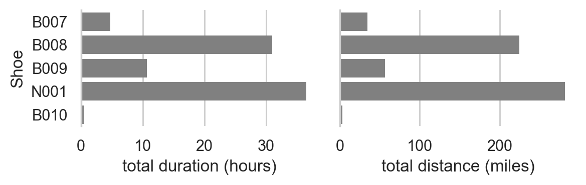
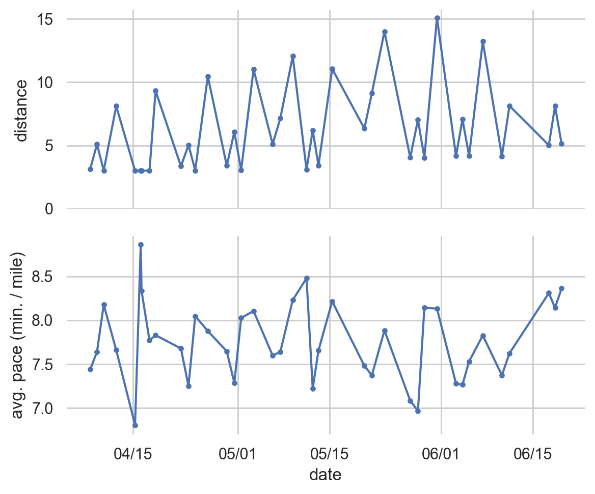
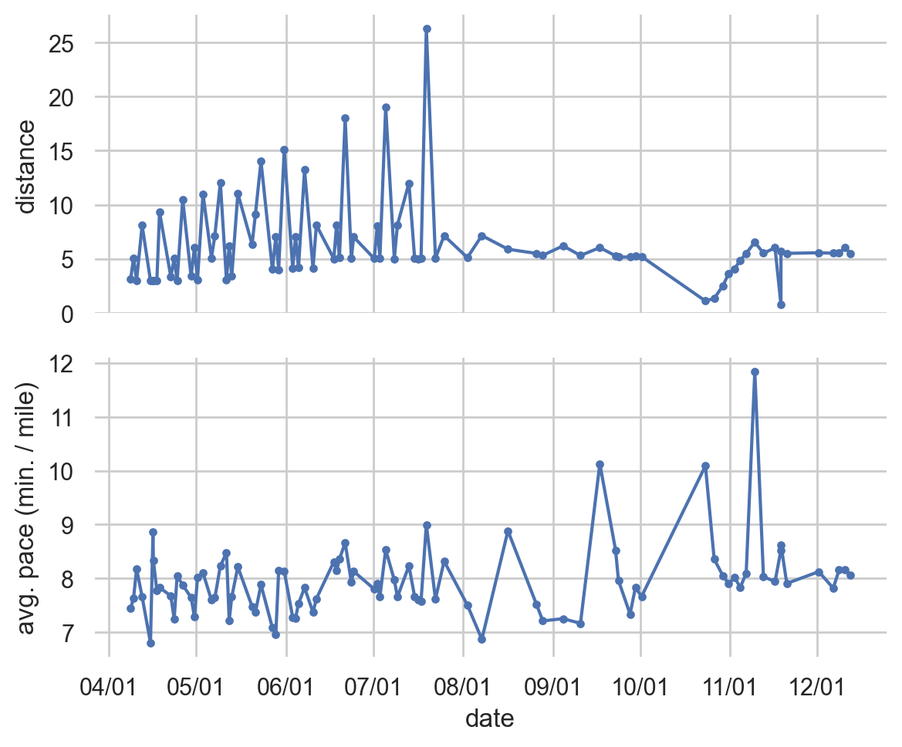

```python
%matplotlib inline
%config InlineBackend.figure_format='retina'
```


```python
import re
from datetime import datetime, timedelta
from loguru import logger
import matplotlib.pyplot as plt
import pandas as pd
import polars as pl
import seaborn as sns
import matplotlib.dates as mdates

from IPython.display import HTML, display
```


```python
sns.set_theme(style="whitegrid")
```

## Data preparation


```python
shoes_data = pl.read_csv("./data/run-tracker/Sheet 1-Shoes.csv").select(
    "UUID", "brand", "model"
)
shoes_order = shoes_data["UUID"].to_list()
shoes_data = shoes_data.with_columns(pl.col("UUID").cast(pl.Enum(shoes_order)))
shoes_data.head()
```


<div><style>
.dataframe > thead > tr,
.dataframe > tbody > tr {
  text-align: right;
  white-space: pre-wrap;
}
</style>
<small>shape: (5, 3)</small><table border="1" class="dataframe"><thead><tr><th>UUID</th><th>brand</th><th>model</th></tr><tr><td>enum</td><td>str</td><td>str</td></tr></thead><tbody><tr><td>&quot;B001&quot;</td><td>&quot;Brooks&quot;</td><td>&quot;Ghost 10&quot;</td></tr><tr><td>&quot;B002&quot;</td><td>&quot;Brooks&quot;</td><td>&quot;Ghost 11&quot;</td></tr><tr><td>&quot;B003&quot;</td><td>&quot;Brooks&quot;</td><td>&quot;Ravenna 11&quot;</td></tr><tr><td>&quot;B004&quot;</td><td>&quot;Brooks&quot;</td><td>&quot;Ghost 13&quot;</td></tr><tr><td>&quot;B005&quot;</td><td>&quot;Brooks&quot;</td><td>&quot;Ghost 13&quot;</td></tr></tbody></table></div>


```python
def _parse_duration(duration_str: str) -> timedelta:
    values = [x.strip() for x in duration_str.split(" ")]
    assert len(values) == 3, f"Unexpected duration format: {duration_str}"
    return timedelta(
        hours=int(values[0].split("h")[0]),
        minutes=int(values[1].split("m")[0]),
        seconds=int(values[2].split("s")[0]),
    )


runs_data = (
    pl.read_csv("./data/run-tracker/Sheet 1-Runs.csv")
    .filter(pl.col("Distance").is_not_null())
    .with_columns(pl.col("Shoe").cast(pl.Enum(shoes_order)))
    .join(shoes_data, left_on="Shoe", right_on="UUID", how="left")
    .with_columns(
        pl.col("Notes").fill_null(""),
        pl.col("Datetime").map_elements(
            lambda x: datetime.strptime(re.sub(r"\u202f", " ", x), "%m/%d/%y %H:%M %p"),
            return_dtype=pl.Datetime,
        ),
        pl.col("Total duration").map_elements(
            _parse_duration, return_dtype=pl.Duration
        ),
        pl.col("Time running").map_elements(_parse_duration, return_dtype=pl.Duration),
    )
    .with_columns(
        pl.col("Time running")
        .map_elements(lambda x: x.total_seconds() / 60, return_dtype=pl.Float64)
        .alias("time_running_minutes"),
        pl.col("Total duration")
        .map_elements(lambda x: x.total_seconds() / 60, return_dtype=pl.Float64)
        .alias("total_duration_minutes"),
    )
    .with_columns(
        (pl.col("total_duration_minutes") / pl.col("Distance")).alias(
            "total_duration_pace"
        ),
        (pl.col("time_running_minutes") / pl.col("Distance")).alias(
            "time_running_pace"
        ),
    )
    .with_columns(
        pl.col("Notes")
        .str.to_lowercase()
        .str.contains("commuting")
        .alias("is_commuting_run")
    )
)
runs_data.head()
```


<div><style>
.dataframe > thead > tr,
.dataframe > tbody > tr {
  text-align: right;
  white-space: pre-wrap;
}
</style>
<small>shape: (5, 19)</small><table border="1" class="dataframe"><thead><tr><th>Shoe</th><th>Datetime</th><th>Distance</th><th>Time running</th><th>Total duration</th><th>Avg. pace</th><th>Conditions</th><th>Windy</th><th>Temp. (F)</th><th>Humidity (%)</th><th>Location</th><th>Notes</th><th>brand</th><th>model</th><th>time_running_minutes</th><th>total_duration_minutes</th><th>total_duration_pace</th><th>time_running_pace</th><th>is_commuting_run</th></tr><tr><td>enum</td><td>datetime[μs]</td><td>f64</td><td>duration[μs]</td><td>duration[μs]</td><td>str</td><td>str</td><td>bool</td><td>i64</td><td>i64</td><td>str</td><td>str</td><td>str</td><td>str</td><td>f64</td><td>f64</td><td>f64</td><td>f64</td><td>bool</td></tr></thead><tbody><tr><td>&quot;B008&quot;</td><td>2024-09-02 03:03:00</td><td>5.02</td><td>null</td><td>40m 28s</td><td>&quot;0h 8m 4s&quot;</td><td>null</td><td>null</td><td>null</td><td>null</td><td>&quot;629 Tremont&quot;</td><td>&quot;&quot;</td><td>&quot;Brooks&quot;</td><td>&quot;Ghost 14&quot;</td><td>null</td><td>40.466667</td><td>8.061089</td><td>null</td><td>false</td></tr><tr><td>&quot;B008&quot;</td><td>2024-09-04 06:56:00</td><td>3.55</td><td>null</td><td>30m 22s</td><td>&quot;0h 8m 33s&quot;</td><td>&quot;Clear&quot;</td><td>null</td><td>54</td><td>82</td><td>&quot;629 Tremont&quot;</td><td>&quot;&quot;</td><td>&quot;Brooks&quot;</td><td>&quot;Ghost 14&quot;</td><td>null</td><td>30.366667</td><td>8.553991</td><td>null</td><td>false</td></tr><tr><td>&quot;B008&quot;</td><td>2024-09-04 04:22:00</td><td>3.04</td><td>null</td><td>26m 9s</td><td>&quot;0h 8m 36s&quot;</td><td>&quot;Clear&quot;</td><td>null</td><td>75</td><td>43</td><td>&quot;Leiden Center 1&quot;</td><td>&quot;&quot;</td><td>&quot;Brooks&quot;</td><td>&quot;Ghost 14&quot;</td><td>null</td><td>26.15</td><td>8.601974</td><td>null</td><td>false</td></tr><tr><td>&quot;B008&quot;</td><td>2024-09-10 07:23:00</td><td>7.35</td><td>null</td><td>55m 40s</td><td>&quot;0h 7m 34s&quot;</td><td>null</td><td>null</td><td>null</td><td>null</td><td>&quot;Fan Pier&quot;</td><td>&quot;&quot;</td><td>&quot;Brooks&quot;</td><td>&quot;Ghost 14&quot;</td><td>null</td><td>55.666667</td><td>7.573696</td><td>null</td><td>false</td></tr><tr><td>&quot;B008&quot;</td><td>2024-09-12 06:50:00</td><td>3.54</td><td>null</td><td>29m 5s</td><td>&quot;0h 8m 13s&quot;</td><td>&quot;Clear&quot;</td><td>null</td><td>54</td><td>85</td><td>&quot;629 Tremont&quot;</td><td>&quot;&quot;</td><td>&quot;Brooks&quot;</td><td>&quot;Ghost 14&quot;</td><td>null</td><td>29.083333</td><td>8.215631</td><td>null</td><td>false</td></tr></tbody></table></div>


```python
TODAY = datetime.now()
for dt in runs_data["Datetime"]:
    if dt > TODAY:
        logger.error(f"Datetime in the future: {dt}")
        raise ValueError("Datetime in the future found in data")
```


```python
MARATHON_TRAINING_STARTDATE = runs_data.filter(
    pl.col("Notes").str.to_lowercase() == "start marathon training"
)["Datetime"][0]
logger.info(f"Starting marathon training: {MARATHON_TRAINING_STARTDATE}")
```

    2025-06-21 06:36:31.757 | INFO     | __main__:<module>:4 - Starting marathon training: 2025-04-08 10:49:00


```python
runs_data = runs_data.with_columns(
    (pl.col("Datetime") >= MARATHON_TRAINING_STARTDATE).alias("is_marathon_training")
)
```

## Analysis


```python
myFmt = mdates.DateFormatter("%m/%d")
```


```python
def display_df(df: pl.DataFrame | pd.DataFrame) -> None:
    if isinstance(df, pl.DataFrame):
        df = df.to_pandas()
    display(HTML(df.to_html()))
```


```python
plot_data = (
    runs_data.group_by("Shoe", "brand", "model")
    .agg(pl.col("total_duration_minutes").sum(), pl.col("Distance").sum())
    .sort(
        "Shoe",
    )
    .with_columns((pl.col("total_duration_minutes") / 60).alias("total_duration_hours"))
    .to_pandas()
)
plot_data["Shoe"] = plot_data["Shoe"].cat.remove_unused_categories()

display_df(plot_data)

fig, axes = plt.subplots(ncols=2, figsize=(6, 2), squeeze=True, sharey=True)
sns.barplot(
    plot_data,
    y="Shoe",
    x="total_duration_hours",
    ax=axes[0],
    linewidth=0,
    color="gray",
)
axes[0].set_xlabel("total duration (hours)")
sns.barplot(plot_data, y="Shoe", x="Distance", ax=axes[1], linewidth=0, color="gray")
axes[1].set_xlabel("total distance (miles)")
for ax in axes:
    sns.despine(ax=ax, left=False, bottom=True)
fig.tight_layout()
plt.show()
```


<table border="1" class="dataframe">
  <thead>
    <tr style="text-align: right;">
      <th></th>
      <th>Shoe</th>
      <th>brand</th>
      <th>model</th>
      <th>total_duration_minutes</th>
      <th>Distance</th>
      <th>total_duration_hours</th>
    </tr>
  </thead>
  <tbody>
    <tr>
      <th>0</th>
      <td>B007</td>
      <td>Brooks</td>
      <td>Ghost 14</td>
      <td>285.083333</td>
      <td>34.32</td>
      <td>4.751389</td>
    </tr>
    <tr>
      <th>1</th>
      <td>B008</td>
      <td>Brooks</td>
      <td>Ghost 14</td>
      <td>1861.616667</td>
      <td>224.25</td>
      <td>31.026944</td>
    </tr>
    <tr>
      <th>2</th>
      <td>B009</td>
      <td>Brooks</td>
      <td>Cascadia</td>
      <td>642.266667</td>
      <td>56.49</td>
      <td>10.704444</td>
    </tr>
    <tr>
      <th>3</th>
      <td>N001</td>
      <td>New Balance</td>
      <td>1080 (v14)</td>
      <td>2191.733333</td>
      <td>281.39</td>
      <td>36.528889</td>
    </tr>
    <tr>
      <th>4</th>
      <td>B010</td>
      <td>Brooks</td>
      <td>Ghost 16</td>
      <td>26.200000</td>
      <td>3.09</td>
      <td>0.436667</td>
    </tr>
  </tbody>
</table>


    

    


```python
runs_data.filter(pl.col("is_marathon_training")).with_columns(
    (pl.col("total_duration_minutes") / 60).alias("total_duration_hours")
).group_by("is_marathon_training").agg(
    pl.col("total_duration_hours").sum(), pl.col("Distance").sum()
).drop("is_marathon_training").rename(
    {"total_duration_hours": "hours run", "Distance": "distance"}
)
```


<div><style>
.dataframe > thead > tr,
.dataframe > tbody > tr {
  text-align: right;
  white-space: pre-wrap;
}
</style>
<small>shape: (1, 2)</small><table border="1" class="dataframe"><thead><tr><th>hours run</th><th>distance</th></tr><tr><td>f64</td><td>f64</td></tr></thead><tbody><tr><td>32.828889</td><td>253.06</td></tr></tbody></table></div>


```python
plot_data = runs_data.filter(pl.col("is_marathon_training")).to_pandas()

fig, axes = plt.subplots(nrows=2, ncols=1, figsize=(6, 5), squeeze=True, sharex=True)

sns.lineplot(plot_data, x="Datetime", y="Distance", ax=axes[0])
sns.scatterplot(plot_data, x="Datetime", y="Distance", ax=axes[0], linewidth=0, s=15)
axes[0].set_ylim(0, None)
axes[0].set_ylabel("distance")

sns.lineplot(plot_data, x="Datetime", y="total_duration_pace", ax=axes[1])
sns.scatterplot(
    plot_data, x="Datetime", y="total_duration_pace", ax=axes[1], linewidth=0, s=15
)
axes[1].set_ylabel("avg. pace (min. / mile)")
axes[1].xaxis.set_major_formatter(myFmt)
axes[1].set_xlabel("date")

for ax in axes:
    sns.despine(ax=ax, left=True, bottom=True)
fig.tight_layout()
plt.show()
```


    

    


```python
plot_data = runs_data.filter(pl.col("is_marathon_training")).to_pandas()

fig, ax = plt.subplots(figsize=(5, 3))
sns.scatterplot(
    plot_data,
    x="Distance",
    y="total_duration_pace",
    linewidth=1,
    s=30,
    hue="is_commuting_run",
    ax=ax,
    alpha=0.8,
    palette={True: "crimson", False: "darkslategray"},
)
sns.despine(ax=ax, left=True, bottom=True)
sns.move_legend(
    ax,
    "upper left",
    bbox_to_anchor=(1, 1),
    title="commuting",
    ncols=1,
    edgecolor="white",
)
ax.set_ylabel("avg. pace (min. / mile)")
ax.set_xlabel("distance (miles)")
fig.tight_layout()
plt.show()
```


    

    


---

## Session information


```python
%load_ext watermark
%watermark -d -u -v -iv -b -h -m
```

    Last updated: 2025-06-21
    
    Python implementation: CPython
    Python version       : 3.12.11
    IPython version      : 9.2.0
    
    Compiler    : Clang 17.0.0 (clang-1700.0.13.3)
    OS          : Darwin
    Release     : 24.5.0
    Machine     : arm64
    Processor   : arm
    CPU cores   : 12
    Architecture: 64bit
    
    Hostname: Joshuas-MacBook-Pro.local
    
    Git branch: main
    
    matplotlib: 3.10.3
    IPython   : 9.2.0
    polars    : 1.29.0
    seaborn   : 0.13.2
    pandas    : 2.2.3
    re        : 2.2.1
    


```python

```
